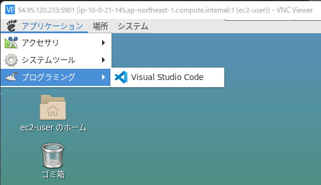
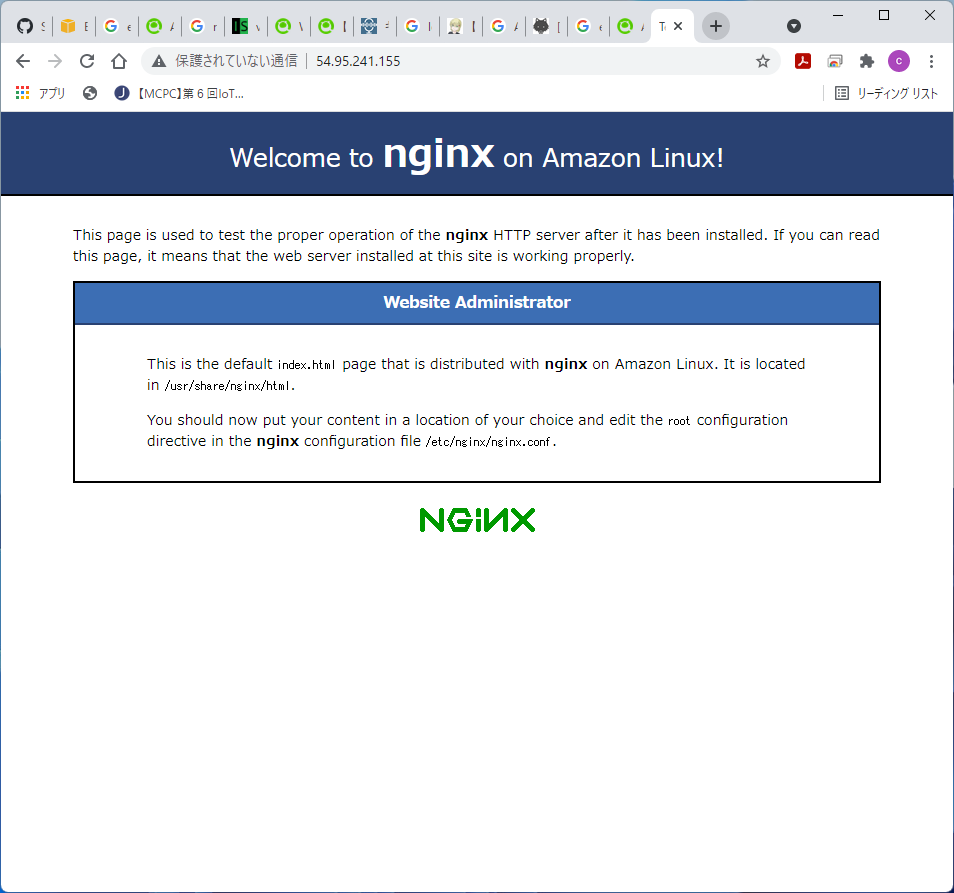

# EC2上にデスクトップ環境(GUI)を構築する


<br>
<br>

# 【前提】EC2ネットワーク環境

EC2はパブリックサブネットに配置し、セキュリティグループのポートは22(SSH)に加えて、3389(RDP)もインバウンドを許可設定しておく。


<br>
<br>

# はじめに
デフォルトユーザ「ec2-user」にパスワードを設定しておく。
``` bash 
sudo passwd ec2-user
```
New password:と表示されたら設定したいパスワードを入力します。  
Retype new password:パスワードを再度入力します。

<br>
<br>

# Linux GUI(MATE)環境を構築する

### ここは[公式情報](https://aws.amazon.com/jp/premiumsupport/knowledge-center/ec2-linux-2-install-gui/)を参照

``` bash
# MATEデスクトップ環境のインストール
$ sudo amazon-linux-extras install mate-desktop1.x

# 全てのユーザーにMATEをデフォルト設定
$ sudo bash -c 'echo PREFERRED=/usr/bin/mate-session > /etc/sysconfig/desktop'
```

<br>
<br>

# ホストPCからリモート接続を行う

以下の流れで、xrdpをインストールする

``` bash
# TigerVNCをインストール
$ sudo yum install tigervnc-server

# EPELリポジトリを使用できるようにするコマンド
$ sudo amazon-linux-extras install epel

# xrdpをインストール
$ sudo yum install xrdp

# xrdpを起動＆常に自動起動するように設定
$ sudo systemctl start xrdp
$ sudo systemctl enable xrdp
```

xrdpが正しく起動しているかチェック
``` bash
sudo systemctl status xrdp
```
正常に動作していた場合は、Active: active (running)と表示されます。
``` bash
● xrdp.service - xrdp daemon
   Loaded: loaded (/usr/lib/systemd/system/xrdp.service; enabled; vendor preset: disabled)
   Active: active (running) since Thu 2021-01-21 09:50:28 UTC; 1min 33s ago
     Docs: man:xrdp(8)
           man:xrdp.ini(5)
 Main PID: 5527 (xrdp)
   CGroup: /system.slice/xrdp.service
           └─5527 /usr/sbin/xrdp --nodaemon
```

<br>

### リモートデスクトップ（Windows）でログインする

接続先として、EC2のパブリックIPアドレスを指定してログインする。


ユーザ名と、最初に登録したパスワードを入力する。


以下のとおり、画面が表示されれば成功。


<br>
<br>

# 日本語化・タイムゾーン変更・日本語入力対応

日本語入力を可能とするIME ibus と、日本語フォント google-noto-sans-japanese-fonts をインストール

``` bash
$ sudo yum install ibus-kkc
$ sudo yum install google-noto-sans-japanese-fonts
```

ibus の設定を bashrc に記載
``` bash
$ sudo nano ~/.bashrc

===末尾に以下を追加===
export GTK_IM_MODULE=ibus
export XMODIFIERS=@im=ibus
export QT_IM_MODULE=ibus
ibus-daemon -drx
```

ロケール設定を ja_JP.UTF-8 に変更
``` bash
$ sudo localectl set-locale LANG=ja_JP.UTF-8
```

タイムゾーンも日本（東京）に変更
``` bash
$ sudo timedatectl set-timezone Asia/Tokyo
```

サーバを再起動
``` bash
$ sudo reboot
```
## 日本語の切り替え方法
Windows + Space キーで、英語⇔日本語入力を切り替えます。


<br>
<br>

# ブラウザ（Google Chrome）インストール

レポジトリファイルを作成する

``` bash
$ sudo nano /etc/yum.repos.d/google.chrome.repo

-------
[google-chrome]
name=google-chrome
baseurl=http://dl.google.com/linux/chrome/rpm/stable/$basearch
enabled=1
gpgcheck=1
gpgkey=https://dl-ssl.google.com/linux/linux_signing_key.pub

```

Chromeをインストールする
``` bash
$ sudo yum install google-chrome-stable
```


# 開発環境のセットアップ

### Visual Studio Codeをインストール
``` bash
$ sudo rpm --import https://packages.microsoft.com/keys/microsoft.asc

$ sudo sh -c 'echo -e "[code]\nname=Visual Studio Code\nbaseurl=https://packages.microsoft.com/yumrepos/vscode\nenabled=1\ngpgcheck=1\ngpgkey=https://packages.microsoft.com/keys/microsoft.asc" > /etc/yum.repos.d/vscode.repo'

$ yum check-update

$ sudo yum install code
```

### 再起動
``` bash
$ sudo reboot
```

以下のように、スタートメニューから起動できるようになる。



### Visual Studio Codeの日本語化
Extention(拡張機能)から、日本語パッケージをインストール


<br>
<br>

# nginxのインストール
amazon-linux-extras から nginx をインストールする
``` bash
$ sudo amazon-linux-extras install nginx1
```

以下のコマンドで、nginxの起動＆自動起動を設定する
``` bash
$ sudo systemctl start nginx
$ sudo systemctl enable nginx
```

### 接続確認
EC2として、セキュリティグループのインバウンド設定に、**80(HTTP)** 許可を追加する。


ブラウザを使用してアクセスし、Webページが表示されることを確認する。


# CloudFormation